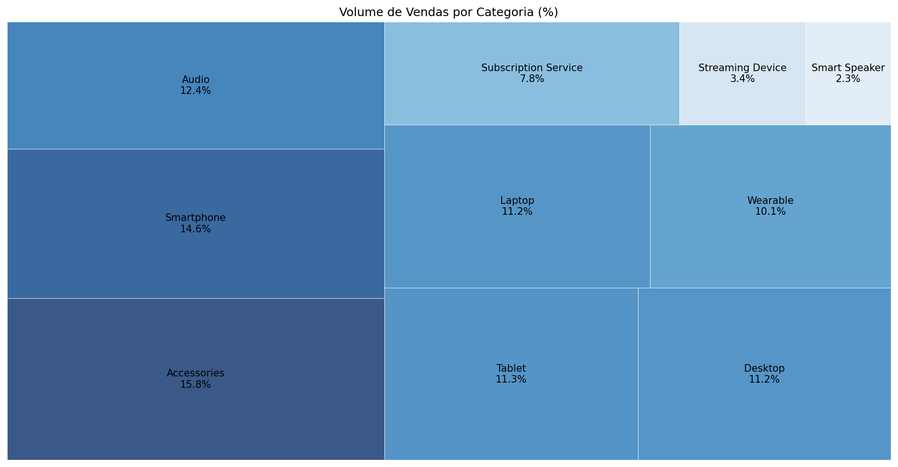
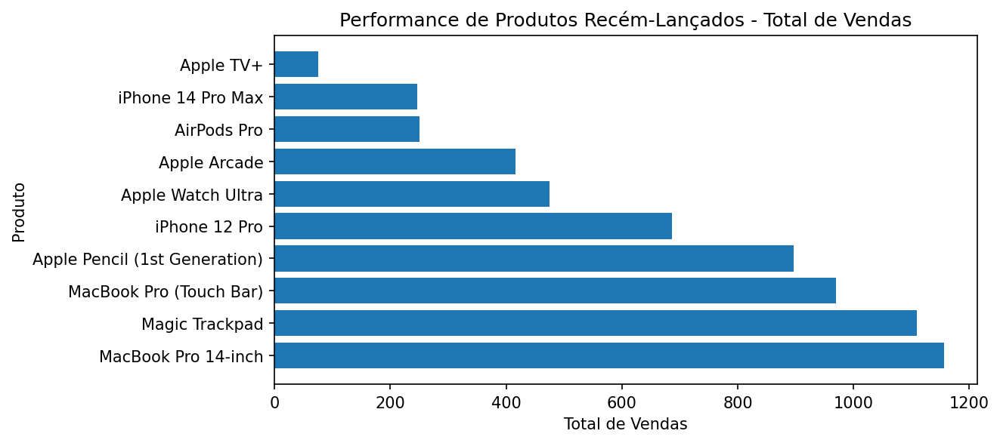
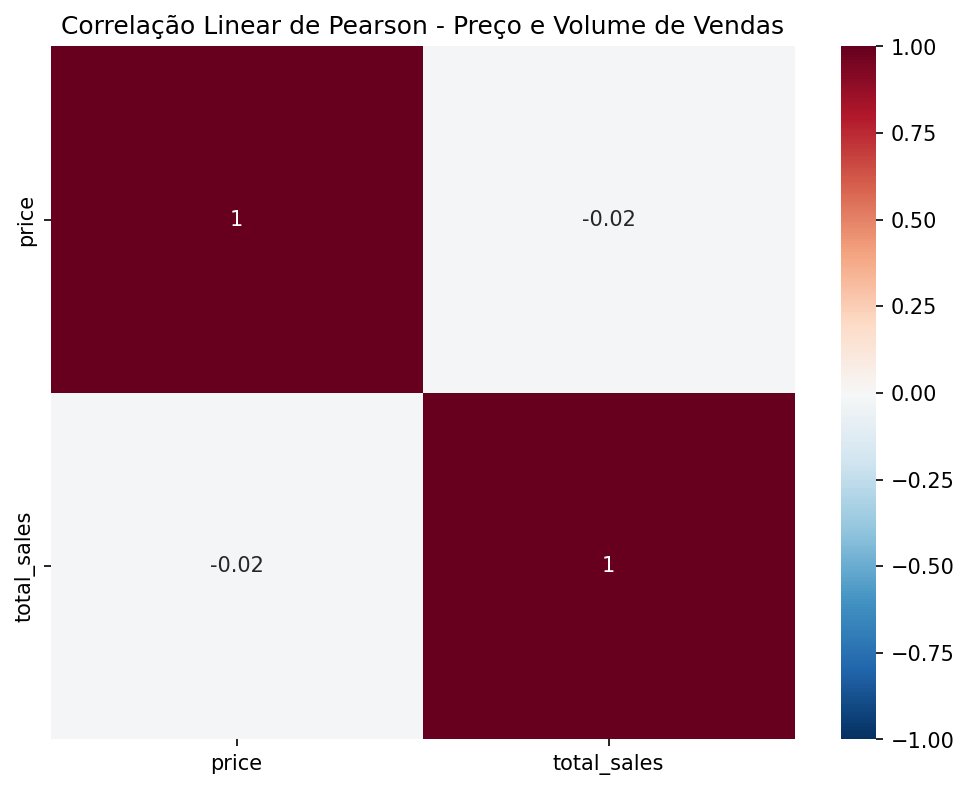
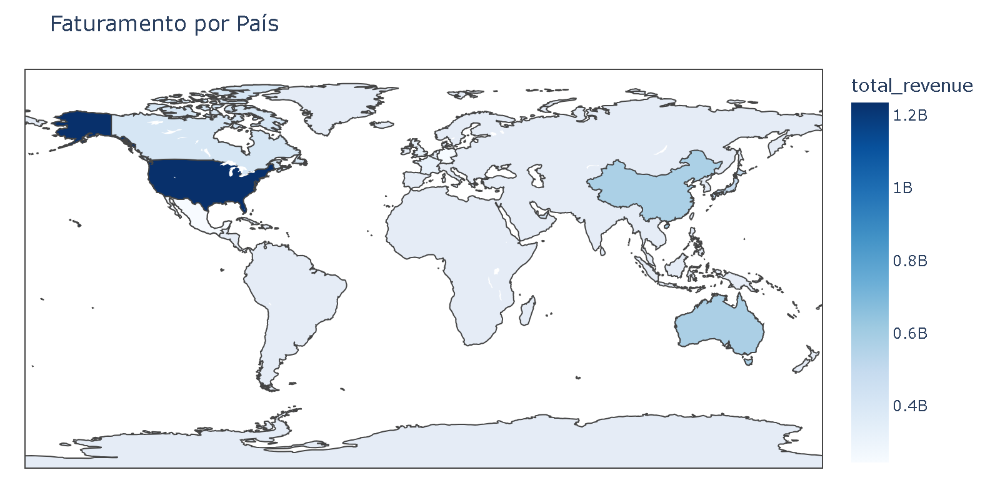

# 🍎 Apple Sales Analysis
 
Análise de dados de vendas simulados da Apple, explorando o desempenho comercial da empresa sob diferentes perspectivas: mix de produtos, performance geográfica e pós-venda.

## 📊 Análises Realizadas

### 1. Performance de Produtos
- Produtos e categorias com maior receita e volume de vendas
- Performance de lançamentos recentes
- Correlação entre preço e volume vendido

### 2. Desempenho Geográfico e por Unidade
- Ranking de faturamento por loja
- Ranking de faturamento por país

---

## ⚙️ Tecnologias e Ferramentas

| Ferramenta | Uso |
|---|---|
| Python 3 | Linguagem principal |
| Pandas | Manipulação e análise de dados |
| Matplotlib / Seaborn | Visualizações estáticas |
| Plotly | Mapa coroplético interativo |
| Squarify | Treemap de volume por categoria |
| Jupyter Notebook | Desenvolvimento e documentação |

---

## 💡 Principais Insights

- **Accessories** é a categoria com maior volume de transações.
- **MacBook Pro 14-inch** se destaca entre os lançamentos mais recentes com 1.156 vendas desde maio/2024
- A correlação entre preço e volume vendido foi de **-0,02**, indicando que os consumidores Apple são pouco sensíveis ao preço.
- **Estados Unidos** lideram em receita — mais que o dobro do 2º colocado (Austrália).

---

## 📈 Exemplos de Análises

  
  
  
  

---

## Observação

> A base de dados utilizada é fictícia e destinada exclusivamente a 
fins educacionais e de demonstração de habilidades em análise de dados.
---

## Autora
Ana Júlia Vieira Lima

